# **Attendance Capture System Using Face Recognition**
Attendance Capture System Using Face Recognition is a application implemented using Python, OpenCV, Pandas, Pillow, PySimpleGUI that works like an application that records attendace using Face Recognition.
  

# Video Link for the Project
The project walkthrough can be viewed [HERE]()
  

# Description
The main objective of this project is to offer system that simplify and automate the process of recording and tracking students’ attendance through face recognition technology. It is biometric technology to identify or verify a person from a digital image or surveillance video.  
Automatically attendance system based on face recognized and also decreases manual work.  
Automatic Attendance System Using Face Recognition for lecturers or staffs, implemented the attendance system. In this system, they use the algorithm of face recognition and attendance marking are developed and used.   
This system captures two images of a student at two pints in time using a digital camera; one is from the start time of the class and other one is in the end time of the class. Both images will process by this system and will make important role to recognize student using facial recognition. If the student recognized both in the start time and end time classes attendance will be marked for that student.
  

# Code Description
**‘Mark Attendance’ button:** 
Teacher/Administrator starts the process by pressing the ‘Mark Attendance’ button and entering the lecture/meeting duration.
Camera gives image/video as input to the model
Model uses face recognition algorithm to recognise the person.
If person is recognised and fulfils the required parameters then person gets the option to clock in or clock out.
Each person is clocked in or out based on their choice and a record is kept of total time for which they were present.
When Teacher presses the ‘Save Attendance’ button, attendance report is generated and saved.  
**‘Add Person’ button:** 
Teacher/Administrator starts the process by pressing the ‘Add Person’ button.
Teacher/Administrator enters the ID and Name for the new person.
Camera captures 100 pictures of the person in real time.  
**‘Train Images’ button:** 
Teacher/Administrator starts the process by pressing the ‘Train Images’ button.
Training of the model is done with the new database.  
**‘View Attendance’ button:** 
Teacher/Administrator starts the process by pressing the ‘View Attendance’ button.
Teacher/Administrator is taken to the directory where all the attendance reports are saved
Teacher/Administrator can view attendance report by clicking ‘Open’ button.
Teacher/Administrator can get back to home by clicking ‘Back’ button.  
**‘Quit’ button:** 
Teacher/Administrator starts the process by pressing the ‘Quit’ button.
Window is closed.
  

# System Requirements
**Functional Requirements:**
* Taking and tracking student attendance by facial recognition in specific time.
* Making a excel file marking the attendance of lecture
* Permitting the lecturer to modify student absent or late
* Determining attendance by the duration the student attended the lecture

**User Requirements:**
* Device supporting Windows 7 or higher
* High resolution camera and screen

**Environmental Requirements:**
* The program should be secure to any unauthorized changes
* Enough storage should be provided for it function properly
* The model should be accurate and identify with great precision
  

# Technologies Used
**Language -**
* Python 3.9

**Module Used -**
* OpenCV Contrib 4.0.1
* Pillow
* Numpy
* Pandas
* CSV
* PySimpleGUI

**Face Recognition Algorithms -**
* Haar Cascade
* LBPH (Local Binary Pattern Histogram)

**Software Used -**
* Pycharm
* VS Code
  

# Software Architecture
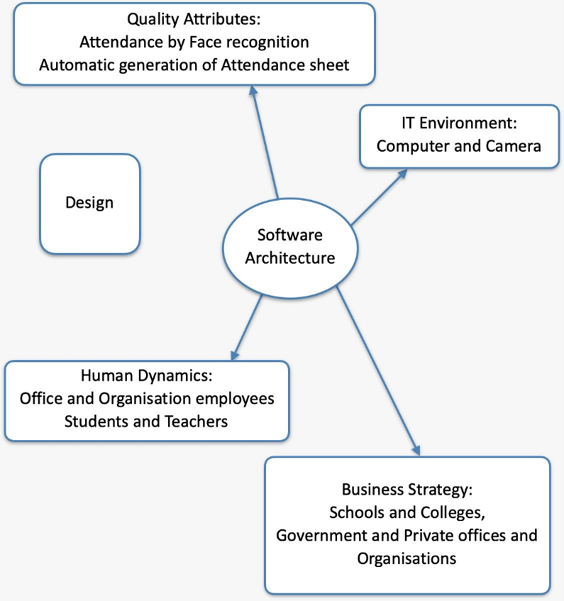
  

# Functionalities
**Home page**
 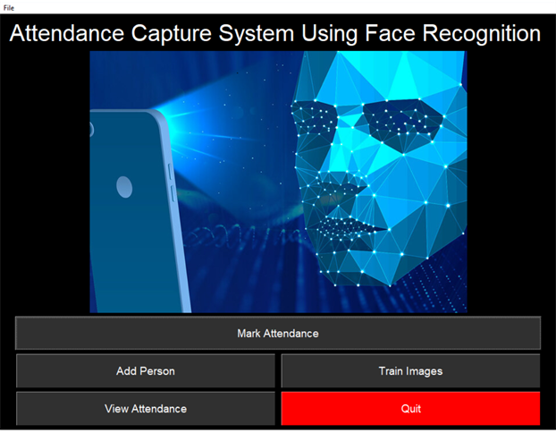  

**Lecture duration popup**
 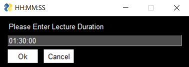  

**Taking Attendance Page**
 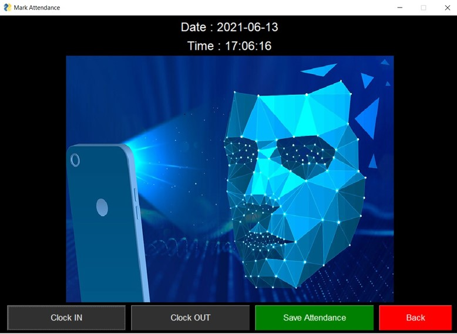 
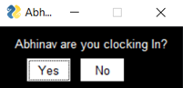
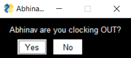
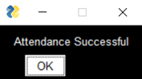  

**Entering new Student data popup**
 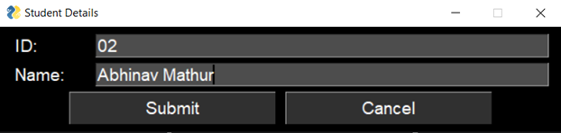  

**Taking face images of new student**
 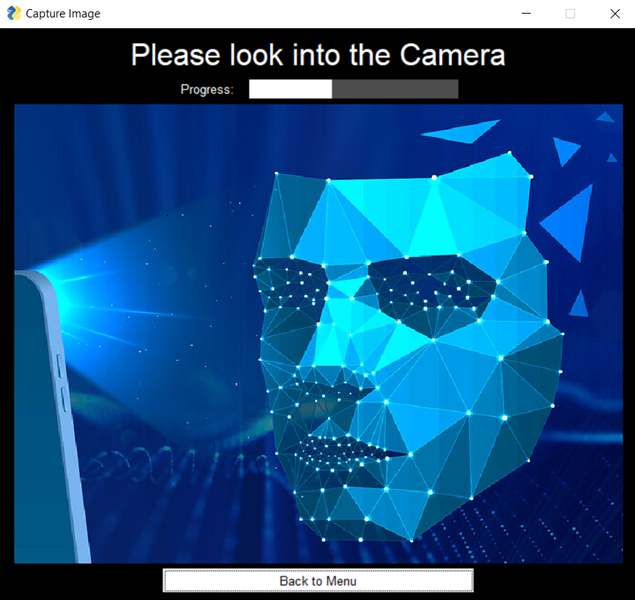  

**Training the model using all images**
 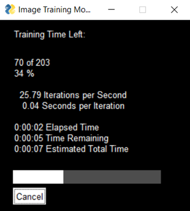  

**Viewing csv attendance**
 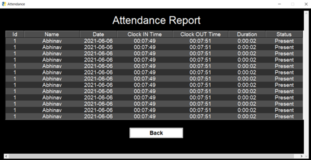
  

# Requirements
Use the package manager [pip](https://pip.pypa.io/en/stable/)

    pip install -r requirements.txt
  

# Running the Project
    python -m venv env
    .\env\Scripts\activate
    pip install -r requirements.txt
    py main.py
  

# References
* https://www.ukessays.com/essays/education/recognition-attendance-system-6424.php
* https://pypi.org/project/face-recognition/
* https://pypi.org/project/opencv-python/
* https://www.youtube.com/watch?v=sz25xxF_AVE
* https://analyticsindiamag.com/a-complete-guide-on-building-a-face-attendance-system/
* https://docs.python.org/3/library/datetime.html
* https://github.com/opencv/opencv/tree/master/data/haarcascades
* https://docs.opencv.org/3.4/db/d28/tutorial_cascade_classifier.html
* https://www.geeksforgeeks.org/python-haar-cascades-for-object-detection/
  

# License

© Abhinav Mathur (ELLIPSIS)

Licensed under [MIT License](LICENSE).
